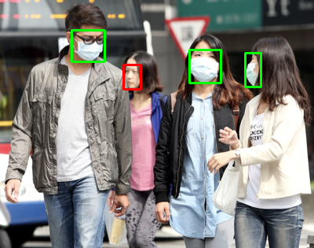
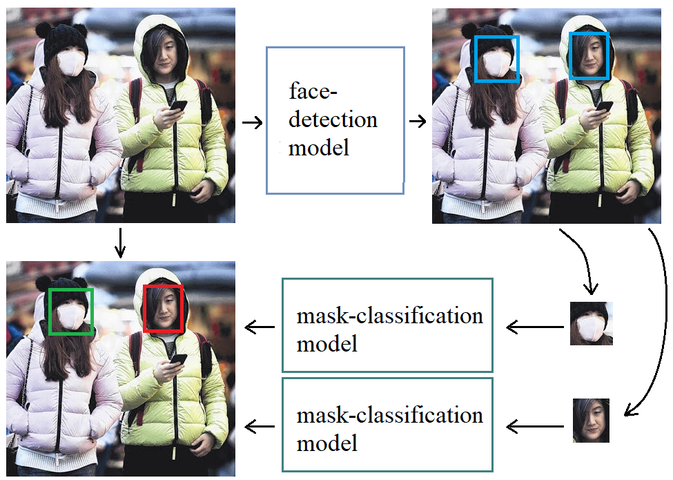
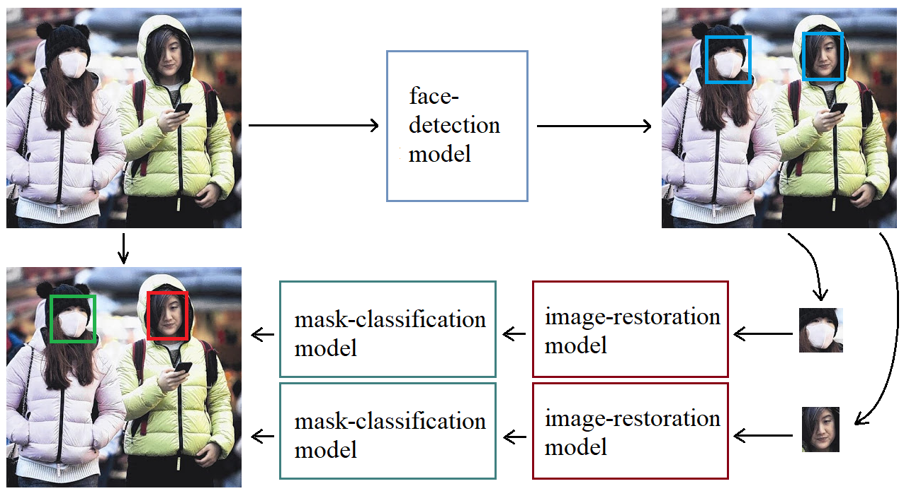
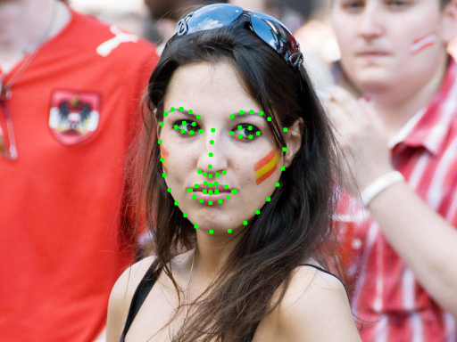
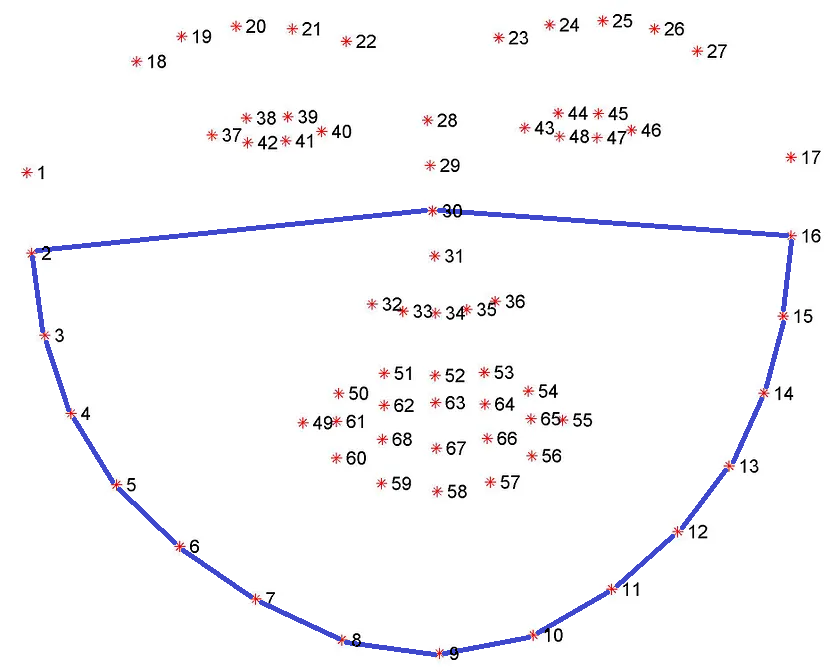
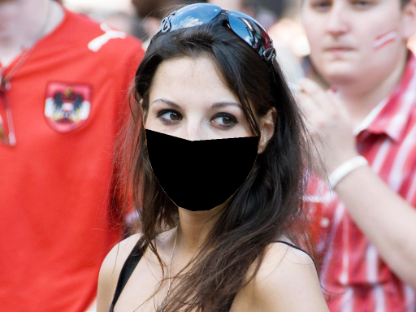
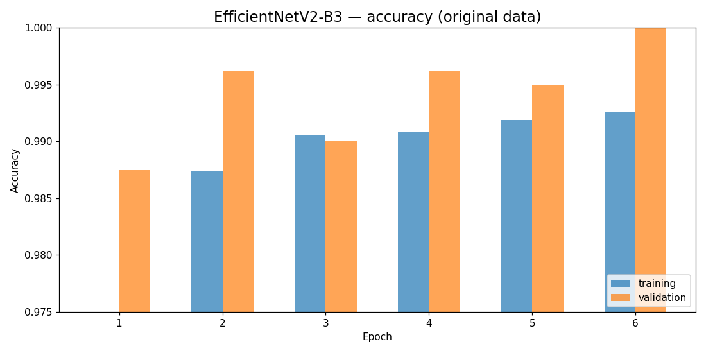
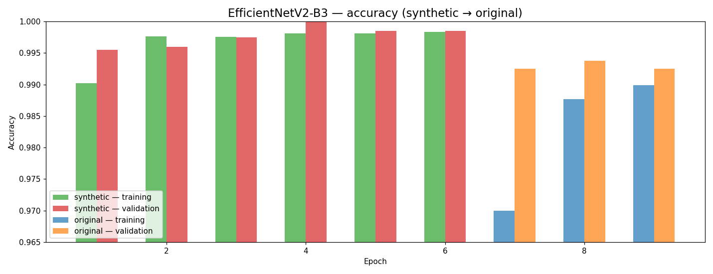

<div align="center">

# Real-Time Face Mask Detection

**A two-stage detector — YOLOv7-Face + EfficientNetV2-B3 — that flags who is (and isn't) wearing a
medical mask, in real time on a CPU.**

[](https://github.com/YuliaYur/mask-detection/actions/workflows/ci.yml)
[](LICENSE)




*Green = wearing a mask, red = not. **87.2% mAP** on a custom dataset of school photos, at **4–5 images/s on a laptop CPU.***

</div>

> Based on my MSc thesis, *Development of software for real-time detection of medical face
> masks* (Ivan Franko National University of Lviv). The thesis is not publicly available, so its
> method and results are described in full below.

---

## Contents

[The idea](#the-idea) · [Method](#method) · [Results & achievements](#results--achievements) ·
[Setup](#setup) · [Datasets](#datasets) · [Usage](#usage) · [Docker](#docker) ·
[Development](#development)

---

## The idea

During the COVID-19 pandemic, automatically checking that people wear masks — in schools and other
public places, from a CCTV frame or a photo — became a genuinely useful task. The hard requirement is
**real time**: the system has to keep up with a video stream on ordinary hardware.

Most one-stage mask detectors are either not real-time or need large amounts of hand-labelled masked
faces. This project takes a different, pragmatic route — **split the task into two well-understood
pieces and reuse strong open models**:

1. **Detect faces** with a fast, pretrained face detector.
2. **Classify each face** as *masked* / *not masked* with a small CNN.

That keeps it fast (the detector is tiny; the classifier runs on 64×64 crops) and accurate. Two ideas
make it robust on real, messy images:

- **Synthetic mask data** — instead of labelling thousands of masked faces, *generate* them: take
  unmasked faces, locate the jaw and nose with facial landmarks, and paint a mask-shaped polygon.
  Pre-training on synthetic masks and then fine-tuning on real data measurably improves accuracy.
- **Optional face restoration** — for low-quality faces, a restoration model (CodeFormer) can be
  inserted before classification. It raises accuracy, but is far slower — a deliberate accuracy/speed
  knob.

---

## Method

### The pipeline

```
Two-stage (real-time):   image ─► YOLOv7-Face ─► face crops ─────────────────────► EfficientNetV2-B3 ─► mask / no-mask
Three-stage (accuracy):  image ─► YOLOv7-Face ─► face crops ─► CodeFormer ─► restored crops ─► EfficientNetV2-B3 ─► mask / no-mask
```

<div align="center">
  
  &nbsp;&nbsp;
  
  <br>
  <em>The two-stage (left) and three-stage (right) detectors applied to a real photo. Boxes, left→right:
  a <b>face-detection model</b> (YOLOv7-Face) finds faces; an optional <b>image-restoration model</b>
  (CodeFormer) cleans the crops; a <b>mask-classification model</b> (EfficientNetV2-B3) labels each one
  (green = mask, red = no mask).</em>
</div>

The three building blocks are vendored as git subtrees and prepared independently:

| Component | Model | Role |
|---|---|---|
| Face detection | **YOLOv7-Face** (`yolov7-lite-s`, WiderFace-pretrained) | locate faces — ~3 GFLOPs @ 640×640 |
| Mask classification | **EfficientNetV2-B3** (frozen ImageNet backbone + 2-class head) | mask / no-mask on 64×64 crops — ~0.27 GFLOPs |
| Face restoration *(optional)* | **CodeFormer** | restore low-quality crops before classifying |

### Innovation 1 — synthetic mask data

Annotated masked-face data is scarce, so the project **synthesises** it. For each unmasked face, SPIGA
predicts facial landmarks; a mask-shaped polygon (jawline + lower nose) is then filled with a random
colour:

<div align="center">
  
  &nbsp;→&nbsp;
  
  &nbsp;→&nbsp;
  
  <br>
  <em>An unmasked face → its SPIGA landmarks → the mask polygon (jaw + nose) → a synthetic masked face.</em>
</div>

**18,000** synthetic masked faces were generated from unmasked [VGG-Face2](https://github.com/ox-vgg/vgg_face2)
images. The classifier is then **pre-trained on synthetic masks and fine-tuned on real data** (transfer
learning), which beats training on real data alone — see the results below.

### Innovation 2 — optional restoration (three-stage)

For low-quality face crops, CodeFormer restores facial detail before classification. It consistently
improves accuracy on both test sets, but **increases inference time by ~80×**, so it's an offline
accuracy boost rather than the real-time default.

---

## Results & achievements

Four variants were evaluated — two classifiers (**original-only** vs **synthetic→original**) × **with /
without** CodeFormer restoration — on two test sets, using **mAP@0.5**:

- **School** — a custom dataset of students and teachers in schools (the target domain).
- **Mask Dataset** — the public Kaggle [Face Mask Detection](https://www.kaggle.com/datasets/andrewmvd/face-mask-detection) set.

| Variant | classifier | restoration | **School** | **Mask Dataset** |
|---|---|:--:|:--:|:--:|
| Detector-Orig | original data | — | 86.3 | 77.2 |
| **Detector-Aug** | **synthetic → original** | — | **87.2** | **81.3** |
| Detector-SR-Orig | original data | CodeFormer | 87.3 | 78.2 |
| **Detector-SR-Aug** | synthetic → original | CodeFormer | **88.9** | **82.2** |

### Key achievements

- **87.2% mAP** on the target School set with the real-time two-stage detector (Detector-Aug).
- **Synthetic data pays off** — the synthetic→original classifier beats original-only on *both* test
  sets (87.2 vs 86.3 on School, **81.3 vs 77.2** on Mask Dataset). Accuracy gained with **zero extra
  labelling**.
- **Real-time on a CPU** — the two-stage detector runs at **~4–5 images/s** (≈220 ms/image) on an
  Intel Core i5; the whole pipeline is only **~3.2 GFLOPs**.
- **Restoration trade-off, quantified** — CodeFormer lifts accuracy to **88.9 / 82.2** but at
  ~17 s/image (~80× slower) — valuable offline, not for real time.

<div align="center">
  
  &nbsp;
  
  <br>
  <em>Classifier training accuracy — original-only (left) vs synthetic→original transfer learning (right).</em>
</div>

**Model complexity** (reproduce with `python -m src.flops`): EfficientNetV2-B3 **0.27 GFLOPs** @ 64×64,
yolov7-lite-s **2.96 GFLOPs** @ 640×640.

> Every number in the table is **reproducible from scratch** with `python -m src.eval` — see
> [Evaluate](#evaluate).

---

## Setup

### Option A — Docker (recommended)

A CPU image plus a Jupyter Lab service that mounts the repo and presets `PYTHONPATH`:

```bash
docker compose up mask-detection-lab
# then open http://localhost:8888
```

### Option B — Local Python (3.9)

```bash
pip install -r docker/requirements.txt            # runtime
pip install -r requirements-test.txt              # to run the unit tests
pip install -r docker/requirements_jupyter.txt    # to open the research notebooks
```

The **trained weights ship with the repo** — the YOLOv7-Face detector and both EfficientNetV2-B3
classifiers (original-only and synthetic→original) — so the two-stage detector runs out of the box.
Only the **optional CodeFormer** weight and the **datasets** are not committed; download CodeFormer per
[`code_former/weights/README.md`](code_former/weights/README.md) and point the CLIs at your dataset. A
typical layout:

```
models/
  yolov7-lite-s.pt                                        # YOLOv7-Face detector            (committed)
  efficientnet_v2_b3/original_data/*.h5                   # classifier, original-only       (committed)
  efficientnet_v2_b3/combined_data/*.h5                   # classifier, synthetic→original  (committed)
code_former/weights/CodeFormer/codeformer.pth            # optional restoration stage      (download)
dataset/                                                  # test/training data              (not committed)
```

## Datasets

- **Classifier training** — the [Face Mask ~12k Images Dataset](https://www.kaggle.com/datasets/ashishjangra27/face-mask-12k-images-dataset)
  (`Train` / `Validation` / `Test`, each with `WithMask` / `WithoutMask` subfolders). Training ran on
  Kaggle GPUs — see [`research/`](research/).
- **Synthetic masks** — generated from unmasked VGG-Face2 faces with `src.synthetic` (masks drawn on SPIGA landmarks).
- **Evaluation** — the custom School set and the Kaggle [Face Mask Detection](https://www.kaggle.com/datasets/andrewmvd/face-mask-detection).

---

## Usage

Every pipeline is a CLI. The original exploratory notebooks live in
[`research/`](research/) (see [`research/README.md`](research/README.md)); the CLIs below are the
reproducible entry points distilled from them.

### Run on your own images

The quickest way to see it work — runs the two-stage detector on an image (or a folder of images)
and writes a copy with each face boxed **green** (mask) or **red** (no mask):

```bash
python -m src.detect --source sample_images\school_sample.png \
    --detector models/yolov7-lite-s.pt \
    --classifier models/efficientnet_v2_b3/combined_data/efficientnetv2_b3_combined_data_epoch_6_3.h5
# annotated images are written to runs/detect/ (use --out-dir to change)
```

`--source` may be a single image or a directory; add `--codeformer code_former/weights/CodeFormer/codeformer.pth`
for the three-stage variant. The trained weights ship with the repo, so this runs out of the box —
producing the same green/red visualization shown at the top of this README.

### Train the classifier

```bash
# EfficientNetV2-B3 on the original data (6 epochs)
python -m src.train --model efficientnet \
    --train-dir "dataset/Face Mask Dataset/Train" \
    --val-dir "dataset/Face Mask Dataset/Validation" \
    --epochs 6 --output models/eff_b3_original.h5
```

Synthetic → original transfer learning (the winning model) chains two runs with `--init-weights`:

```bash
python -m src.train --model efficientnet --train-dir data/synthetic/train --val-dir data/synthetic/val \
    --epochs 6 --output models/eff_b3_synthetic.h5
python -m src.train --model efficientnet --train-dir "dataset/Face Mask Dataset/Train" \
    --val-dir "dataset/Face Mask Dataset/Validation" --epochs 3 \
    --init-weights models/eff_b3_synthetic.h5 --output models/eff_b3_combined.h5
```

Train/val directories hold two class subfolders (the mask class must sort first, e.g. `with_mask/`,
`without_mask/`). Each run also writes a `*.history.json`. (`--model vgg` trains a VGG19 baseline.)

### Generate synthetic masked faces

```bash
python -m src.synthetic.sample_faces \
    --src-glob "dataset/VGG-Face2/data/crops/**/*.jpg" \
    --out-dir data/synthetic/no_mask --count 18000
python -m src.synthetic.draw_masks --in-dir data/synthetic/no_mask --out-dir data/synthetic/mask
```

### Evaluate

One command — `python -m src.eval` — converts the dataset's labels to COCO ground truth, runs the
detector + classifier, and computes mAP:

```bash
python -m src.eval --dataset school \
    --annotations-dir dataset/School/annotation --images-dir dataset/School/raw \
    --detector models/yolov7-lite-s.pt \
    --classifier models/efficientnet_v2_b3/combined_data/efficientnetv2_b3_combined_data_epoch_6_3.h5
```

Useful flags: `--codeformer code_former/weights/CodeFormer/codeformer.pth` for the three-stage variant;
`--use-gt-boxes` (omit `--detector`) to score the classifier on its own; `--detector-only` to score
detection regardless of mask class; `--dataset kaggle` for the VOC-XML "Mask Dataset". Pass
`--annotations` / `--predictions` to reuse precomputed artifacts (cache with `--save-annotations` /
`--save-predictions`).

### Model FLOPs

```bash
python -m src.flops \
    --classifier models/efficientnet_v2_b3/original_data/efficientnetv2_b3_original_data_epoch_6.h5 \
    --detector models/yolov7-lite-s.pt
```

Reports GFLOPs (= 2 × MACs): **~0.27** for EfficientNetV2-B3 @ 64×64 and **~2.96** for yolov7-lite-s @
640×640. Keras model via a layer estimator, the PyTorch detector via
[ptflops](https://github.com/sovrasov/flops-counter.pytorch).

---

## Docker

`docker compose up mask-detection-lab` builds the CPU image and starts Jupyter Lab on
[localhost:8888](http://localhost:8888), with the repo mounted and `PYTHONPATH` preset so the CLIs and
notebooks run as-is. Point `DATA_PATH` at your dataset directory if it lives elsewhere.

## Updating vendored components (git subtrees)

The three external models are tracked as subtrees. Pull upstream updates with:

```bash
git subtree pull --prefix=<subdirectory> <remote-name> <branch> --squash
```

| subdirectory | remote name | branch | upstream |
|---|---|---|---|
| `yolo7_face` | `yolo7_face` | `main` | `git@github.com:derronqi/yolov7-face.git` |
| `spiga_project` | `spiga_project` | `main` | `git@github.com:andresprados/SPIGA.git` |
| `code_former` | `code_former` | `master` | `git@github.com:sczhou/CodeFormer.git` |

## Development

Formatting, linting and tests cover **`src/` and `tests/`** — the vendored subtrees and the research
notebooks are excluded.

```bash
pip install -r requirements-dev.txt -r requirements-test.txt   # tools + light test deps
make format        # auto-format with black
make test          # run the unit tests
make check         # black --check + flake8 + pylint + pytest
```

## License

[MIT](LICENSE) © Yuliana Yurchenko
